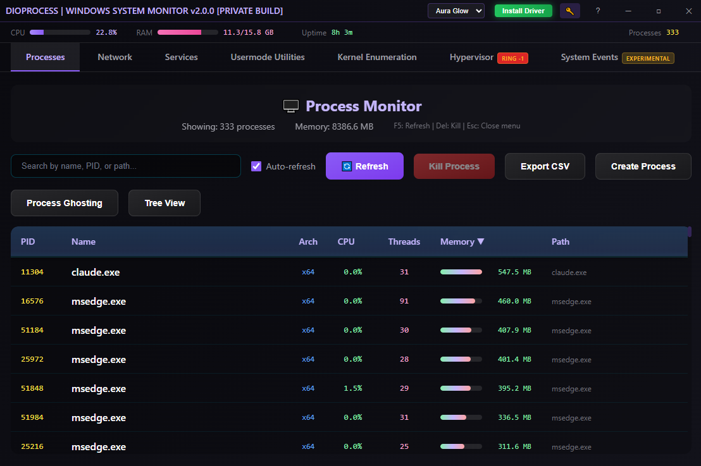

# DioProcess — Advanced Windows Process & System Monitor

Modern, Windows desktop application for real-time system monitoring and low-level process manipulation.
Built with **Rust 2021** + **Dioxus 0.6** (desktop renderer)
**Requires administrator privileges** (UAC `requireAdministrator` embedded at build time via manifest)




[](https://www.rust-lang.org)
[](https://microsoft.com/windows)
[](https://dioxuslabs.com)

## Core Features

- Live enumeration of processes, threads, handles, modules & virtual memory regions
- TCP/UDP connection listing with owning process (via IP Helper API)
- Windows Service enumeration, start/stop/create/delete (Service Control Manager)
- **System Events (Experimental)** — real-time kernel event capture via custom WDM driver:
  - Process/thread create & exit events
  - Image (DLL/EXE) load events
  - Handle operations (process/thread handle create & duplicate)
  - Registry operations (create, open, set, delete, rename, query)
  - **SQLite persistence** with 24-hour retention and paginated UI
- **Security Research Features (Kernel Driver)** — Direct kernel structure manipulation for process protection and privilege escalation:
  - **Process Protection** — Apply/remove PPL (Protected Process Light) protection via `_EPROCESS` modification
  - **Token Privilege Escalation** — Enable all 40 Windows privileges via `_TOKEN` modification
  - **Clear Debug Flags** — Remove debugger indicators (DebugPort, PEB.BeingDebugged, NtGlobalFlag)
  - **Callback Enumeration** — List registered process/thread/image kernel callbacks (identify EDR/AV hooks)
  - **PspCidTable Enumeration** — Enumerate all processes/threads via kernel CID table (detect hidden processes)
  - Supports Windows 10 (1507-22H2) and Windows 11 (21H2-24H2)
- **Hypervisor (Ring -1) Features** — Intel VT-x based hypervisor bundled into DioProcess.sys for advanced security research:
  - **Ring -1 Injection** — Shellcode/DLL injection via hypervisor physical memory access (bypasses ring 0 protections)
  - **Process Hiding** — Hide processes from ring 0 enumeration via EPT hooks
  - **Driver Hiding** — Hide kernel drivers from ring 0 enumeration
  - Physical memory read/write via EPT translation
- **7 DLL injection techniques** — from classic LoadLibrary to function stomping & full manual mapping
- **Shellcode injection** — classic (from .bin file), web staging (download from URL via WinInet), and threadless (hook exported function, no new threads)
- **Kernel injection** (requires driver) — shellcode & DLL injection from kernel mode via `RtlCreateUserThread`, bypasses usermode hooks
- **Early kernel injection** (requires driver) — inject DLLs before any user code executes via APC callback when kernel32.dll loads (Trampoline method removed due to stability issues)
- **DLL Unhooking** — restore hooked DLLs (ntdll, kernel32, kernelbase, user32, advapi32, ws2_32) by replacing .text section from disk
- **Hook Detection & Unhooking** — scan IAT entries for inline hooks (E9 JMP, E8 CALL, EB short JMP, FF25 indirect JMP, MOV+JMP x64 patterns), compare with disk, and optionally unhook detected hooks
- **Process String Scanning** — extract ASCII and UTF-16 strings from process memory with configurable min length, encoding filter, paginated results (1000/page), and text export
- Advanced process creation & masquerading:
  - Normal `CreateProcessW` (suspended option)
  - PPID spoofing (`PROC_THREAD_ATTRIBUTE_PARENT_PROCESS`)
  - Classic process hollowing (unmap → map → relocations → PEB patch → thread hijack)
  - **Process ghosting** (fileless execution via orphaned image section + `NtCreateProcessEx`)
  - **Ghostly hollowing** (ghost section mapped into suspended legitimate process via `NtMapViewOfSection` + thread hijack)
  - **Process herpaderping** (write payload PE to temp file, create image section, overwrite file with legitimate PE before inspection)
  - **Herpaderping hollowing** (herpaderping + hollowing: payload section mapped into suspended legit process, temp file overwritten with legit PE, thread hijacked)
- Primary token theft & impersonation (`CreateProcessAsUserW` under stolen token)
- **Utilities tab** — File bloating (append null bytes or random data to inflate file size, 1–2000 MB)

## Project Structure (Cargo Workspace)

```
crates/
├── process/       # ToolHelp32, NtQueryInformationThread, VirtualQueryEx, modules, memory regions, string scanning
├── network/       # GetExtendedTcpTable / GetUdpTable → PID mapping
├── service/       # SCM: EnumServicesStatusEx, Start/Stop/Create/Delete service
├── callback/      # Kernel driver communication + SQLite event storage + security research IOCTLs + hypervisor
│   └── src/
│       ├── lib.rs         # Module re-exports
│       ├── driver.rs      # IOCTLs (protection, privileges, debug flags, callback enumeration)
│       ├── hypervisor.rs  # Bundled hypervisor (Ring -1) bindings (hv_is_running, hv_inject_shellcode, hv_inject_dll)
│       ├── pspcidtable.rs # PspCidTable enumeration via signature scanning
│       ├── early_injection.rs # Early kernel injection (APC method only, Trampoline removed)
│       ├── storage.rs     # SQLite persistence (WAL mode, batched writes)
│       ├── types.rs       # CallbackEvent, EventType, EventCategory
│       └── error.rs       # CallbackError enum
├── misc/          # DLL injection (7 methods), process hollowing, ghosting, token theft, hook scanning, NT syscalls
│   └── src/
│       ├── lib.rs              # Module declarations + pub use re-exports
│       ├── error.rs            # MiscError enum
│       ├── injection/          # 7 DLL injection techniques (each in own file)
│       ├── shellcode_inject/   # Shellcode injection techniques (classic, etc.)
│       ├── memory.rs           # commit/decommit/free memory
│       ├── module.rs           # unload_module
│       ├── process/            # create, ppid_spoof, hollow, ghost, ghostly_hollow, herpaderp, herpaderp_hollow
│       ├── token.rs            # steal_token
│       ├── unhook.rs           # DLL unhooking (local + remote process)
│       └── hook_scanner.rs     # IAT hook detection (E9/E8/EB/FF25/MOV+JMP patterns)
├── ui/            # Dioxus components, router, global signals, dark theme
└── dioprocess/    # Binary crate — entry point, custom window, manifest embedding
kernelmode/
└── DioProcess/        # WDM kernel driver (C++) with bundled Intel VT-x hypervisor
    ├── DioProcessDriver/
    │   ├── DioProcessDriver.cpp    # Driver code (device: \\.\DioProcess)
    │   ├── DioProcessDriver.h      # Protection structures, Windows version detection
    │   ├── DioProcessCommon.h      # Shared event structures + security IOCTLs
    │   ├── IRP/DeviceControl.cpp   # IOCTL handlers including hypervisor injection
    │   └── Hypervisor/             # Bundled Intel VT-x hypervisor (EPT, VMCALL handlers)
    └── DioProcessCli/              # Test CLI client
```

## Implemented Techniques — Summary

### DLL Injection Methods (misc crate)

1. **LoadLibrary** — `CreateRemoteThread` + `WriteProcessMemory` + `LoadLibraryW`
2. **Thread Hijack** — Suspend thread → alter RIP → shellcode
3. **APC Queue** — `QueueUserAPC` + `LoadLibraryW` on alertable threads
4. **EarlyBird** — Suspended `CreateRemoteThread` → `QueueUserAPC` before first run
5. **Remote Mapping** — `CreateFileMapping` + `NtMapViewOfSection` (no `VirtualAllocEx`)
6. **Function Stomping** — Overwrite sacrificial function (e.g. `setupapi!SetupScanFileQueueA`) with shellcode
7. **Manual Mapping** — PE parsing, section mapping, import resolution, per-section memory protections, `FlushInstructionCache`, call `DllMain`

### Shellcode Injection Methods (misc crate)

1. **Classic** — Read raw shellcode from `.bin` file → `VirtualAllocEx(RW)` → `WriteProcessMemory` → `VirtualProtectEx(RWX)` → `CreateRemoteThread`
2. **Web Staging** — Download shellcode from URL via WinInet (`InternetOpenW` → `InternetOpenUrlW` → `InternetReadFile` in 1024-byte chunks) → inject using classic technique
3. **Threadless** — Hook an exported function (e.g. `USER32!MessageBoxW`) with a CALL trampoline → payload fires when the function is naturally called by the target process (no `CreateRemoteThread`). Self-healing hook restores original bytes after execution.

Access via context menu: **Miscellaneous → Shellcode Injection → Classic**, **Web Staging**, or **Threadless**

### Kernel Injection (requires driver)

Located in `crates/misc/src/kernel_inject.rs` + `kernelmode/DioProcess/DioProcessDriver/DioProcessDriver.cpp`:

1. **Kernel Shellcode Injection** — Allocate RWX memory in target process, write shellcode, create thread via `RtlCreateUserThread` from kernel mode (bypasses usermode hooks)
2. **Kernel DLL Injection** — Allocate memory for DLL path, resolve `LoadLibraryW` address in target process via PEB walking + PE export parsing, create thread with `RtlCreateUserThread(LoadLibraryW, dll_path)`

**Implementation:**
- Uses undocumented `RtlCreateUserThread` kernel API (resolved dynamically via `MmGetSystemRoutineAddress`)
- Attaches to target process context via `KeStackAttachProcess`
- Allocates memory via `ZwAllocateVirtualMemory`, writes data via `RtlCopyMemory`
- For DLL injection: walks PEB→Ldr→InLoadOrderModuleList to find `kernel32.dll`, parses PE exports to find `LoadLibraryW`
- Version-aware PEB access using `PROCESS_PEB_OFFSET[]` table (supports Windows 10 1507+ and Windows 11)
- Returns `STATUS_NOT_SUPPORTED` for unsupported Windows versions

**Access:** Right-click process → **Miscellaneous → Kernel Injection** → Shellcode Injection or DLL Injection (grayed out when driver not loaded)

### Early Kernel Injection (requires driver)

Inject DLLs into processes **before any user code executes** — triggered by kernel callbacks at process creation time.

**NOTE:** Only the **APC Callback** method is supported. The Trampoline method was removed due to stability issues (PEB.Ldr not initialized at process creation time caused STATUS_ILLEGAL_INSTRUCTION errors).

**How it works (APC method):**
1. Arm injection with target process name (e.g., "notepad.exe") and DLL path
2. Kernel's `PsSetLoadImageNotifyRoutine` callback monitors DLL loads
3. When `kernel32.dll` loads in a matching target process:
   - Allocate memory, write DLL path, resolve `LoadLibraryW` via PEB walking
   - Queue kernel APC targeting the main thread
   - APC fires during process initialization, calling `LoadLibraryW(dll_path)`
4. One-shot mode: auto-disarm after first successful injection

**Use cases:**
- Inject monitoring/logging DLLs before application code runs
- Bypass DLL load order restrictions
- Security research on early-stage process behavior

**Access:** Process tab toolbar → **Early Injection** button → opens modal with target process name, DLL path picker, one-shot toggle, and arm/disarm controls (disabled when driver not loaded)

**Located in:** `crates/callback/src/early_injection.rs` (Rust bindings), `kernelmode/DioProcess/DioProcessDriver/Injection/EarlyInjection.cpp` (kernel implementation)

### Hypervisor (Ring -1) Features

**Requires DioProcess.sys kernel driver with bundled hypervisor.** The hypervisor is integrated into DioProcess.sys — no separate driver needed. Operates at Ring -1 (hypervisor level) via Intel VT-x, providing capabilities that bypass even kernel-level protections.

#### Ring -1 Injection (Hypervisor-Level)

Inject shellcode or DLLs from the hypervisor level, bypassing ring 0 protections via EPT (Extended Page Tables) and physical memory access:

1. **HV Shellcode Injection** — Allocate RWX memory in target process from ring 0, write shellcode via hypervisor physical memory access (VMCALL), create thread via `RtlCreateUserThread`
2. **HV DLL Injection** — Same physical memory approach for LoadLibraryW-based DLL injection

**Key advantages over Ring 0 injection:**
- Writes directly to physical memory via EPT, bypassing ring 0 memory protections
- Memory must be "touched" (paged in) before hypervisor can write — driver handles this automatically
- Invisible to ring 0 monitoring tools

**Access:** Right-click process → **Miscellaneous → HV Inject Shellcode (Ring -1)** or **HV Inject DLL (Ring -1)**

**Implementation:**
- Driver allocates memory via `ZwAllocateVirtualMemory`, touches it with `RtlZeroMemory` to create physical backing
- VMCALL hypercall to bundled hypervisor for physical memory write via EPT translation
- Thread creation via `RtlCreateUserThread` from kernel mode
- Located in: `kernelmode/DioProcess/DioProcessDriver/IRP/DeviceControl.cpp` and `crates/callback/src/hypervisor.rs`

**PatchGuard Safety:** Data-only modifications to usermode memory do not trigger KPP. The hypervisor operates outside PatchGuard's scope.

#### Hypervisor Tab Features

Access via the **Hypervisor** tab (marked with red "Ring -1" badge) in main navigation:

- **Status Section** — Shows hypervisor running state, DioProcess driver status
- **Memory Operations** — Read/write physical and virtual memory via hypervisor
- **Process Hiding** — Hide processes from ring 0 enumeration via EPT hooks
- **Driver Hiding** — Hide kernel drivers from ring 0 enumeration
- **Injection** — Ring -1 shellcode and DLL injection with target process selector

**Architecture:**
```
┌─────────────────────────────────────────────────────────────┐
│                 DioProcess UI (Dioxus)                      │
│   Hypervisor Tab (Ring -1)                                  │
└──────────────────────────┬──────────────────────────────────┘
                           │ DeviceIoControl
┌──────────────────────────▼──────────────────────────────────┐
│              callback crate (Rust bindings)                  │
│   hv_is_running(), hv_inject_shellcode(), hv_inject_dll()   │
└──────────────────────────┬──────────────────────────────────┘
                           │ IOCTL
┌──────────────────────────▼──────────────────────────────────┐
│                  DioProcess.sys                              │
│   ┌─────────────────────────────────────────────────────┐   │
│   │  Ring 0: Kernel Driver (IOCTL handlers, memory ops) │   │
│   └──────────────────────────┬──────────────────────────┘   │
│                              │ VMCALL                        │
│   ┌──────────────────────────▼──────────────────────────┐   │
│   │  Ring -1: Bundled Hypervisor (Intel VT-x, EPT)      │   │
│   └─────────────────────────────────────────────────────┘   │
└─────────────────────────────────────────────────────────────┘
```

### Kernel Callback Enumeration

Enumerate registered kernel callbacks via the **Kernel Utilities** tab → **Callback Enumeration**:

- **Process callbacks** — `PsSetCreateProcessNotifyRoutineEx` registrations (AV/EDR process monitoring)
- **Thread callbacks** — `PsSetCreateThreadNotifyRoutine` registrations
- **Image load callbacks** — `PsSetLoadImageNotifyRoutine` registrations (DLL/EXE load monitoring)
- **Object callbacks** — `ObRegisterCallbacks` registrations (handle operation monitoring for process/thread handles)
  - Shows pre-operation and post-operation callback addresses
  - Displays callback altitude (priority) and monitored operations (Create/Duplicate)
  - Commonly used by EDR/AV to monitor handle access to protected processes
- Returns callback address, slot index, and owning driver module name
- Useful for identifying EDR hooks, rootkit callbacks, security product registrations
- Located in `crates/callback/src/driver.rs`: `enumerate_process_callbacks()`, `enumerate_thread_callbacks()`, `enumerate_image_callbacks()`, `enumerate_object_callbacks()`

### PspCidTable Enumeration

Enumerate all processes and threads via the kernel's CID handle table via **Kernel Utilities** tab → **PspCidTable**:

- Lists all PIDs/TIDs with their EPROCESS/ETHREAD kernel addresses
- Uses **signature scanning** (no hardcoded offsets) to locate `PspCidTable`
- Can detect hidden processes (DKOM) by comparing with usermode enumeration
- Read-only operation — PatchGuard/KPP safe
- Located in `crates/callback/src/pspcidtable.rs`: `enumerate_pspcidtable()` → `Vec<CidEntry>`

### Clear Debug Flags (Anti-Anti-Debugging)

Remove debugger presence indicators from a process via right-click → **Miscellaneous → Clear Debug Flags**:

- Zeros `EPROCESS.DebugPort` — bypasses `NtQueryInformationProcess(ProcessDebugPort)`
- Zeros `PEB.BeingDebugged` — bypasses `IsDebuggerPresent()`
- Zeros `PEB.NtGlobalFlag` — bypasses heap-based debug checks (FLG_HEAP_* flags)
- Requires kernel driver for direct structure access
- Located in `crates/callback/src/driver.rs`: `clear_debug_flags(pid)`

### Process Creation & Stealth

- Normal + suspended
- PPID spoofing via extended startup attributes
- Process hollowing — full unmap, section-by-section write, relocations, PEB.ImageBaseAddress patch, section protection fix, thread context hijack (RCX)
- **Process ghosting** — temp file → delete disposition → `SEC_IMAGE` section → orphaned section → `NtCreateProcessEx` → normalized process parameters → `NtCreateThreadEx`
- **Ghostly hollowing** — Create ghost section (temp file → mark deleted → write PE → SEC_IMAGE section → file deleted), create legitimate host process SUSPENDED via `CreateProcessW`, map ghost section into remote process via `NtMapViewOfSection`, hijack thread (set RCX to entry point, patch PEB.ImageBase via `WriteProcessMemory`), resume thread
- **Process herpaderping** — Write payload PE to a temp file, create an image section from it, create a process from the section, then overwrite the temp file with a legitimate PE. When AV/OS inspects the on-disk file, it sees the legitimate PE, but the in-memory image is the payload. Located in `crates/misc/src/process/herpaderp.rs`; function: `herpaderp_process(pe_path, pe_args, legit_img)`. Key NT APIs: `NtCreateSection`, `NtCreateProcessEx`, `NtCreateThreadEx`, `RtlCreateProcessParametersEx`. Note: the legitimate image should be larger than the payload PE.
- **Herpaderping hollowing** — Combines herpaderping with hollowing: write payload PE to temp file, create image section, launch legitimate process suspended, map section into it, overwrite temp file with legitimate PE, hijack thread execution and resume. The on-disk file shows the legitimate PE while the in-memory mapped section runs the payload inside a legitimate process. Located in `crates/misc/src/process/herpaderp_hollow.rs`; function: `herpaderp_hollow_process(pe_path, legit_img)`. Key APIs: `NtCreateSection`, `CreateProcessW` (SUSPENDED), `NtMapViewOfSection`, `NtWriteVirtualMemory`, `GetThreadContext`, `SetThreadContext`, `ResumeThread`. Note: the legitimate image should be larger than the payload PE.

### DLL Unhooking

Restore hooked DLLs in **any process** by reading a clean copy from `System32` and replacing the in-memory `.text` section:
- Remote process unhooking via `VirtualProtectEx` + `WriteProcessMemory`
- Parse PE headers to locate `.text` section (RVA + raw offset)
- Read clean DLL from disk, make .text writable, copy clean bytes, restore protection
- Supports: `ntdll.dll`, `kernel32.dll`, `kernelbase.dll`, `user32.dll`, `advapi32.dll`, `ws2_32.dll`
- **Test suite** included in `assets/unhook_test/` with MinHook-based hook DLL

### Hook Detection & Removal

Scan process IAT (Import Address Table) for inline hooks by comparing imported function bytes with original DLL from disk:
- Parse PE Import Directory to enumerate all imported DLLs and functions
- Read first 16 bytes of each imported function from process memory
- Detect multiple hook types:
  - **E9 JMP** — Near jump (5-byte inline hook)
  - **E8 CALL** — Near call hook
  - **EB Short JMP** — Short jump (2-byte hook)
  - **FF25 Indirect JMP** — Indirect jump via memory
  - **MOV+JMP x64** — `48 B8 [addr] FF E0` or `48 B8 [addr] 50 C3` patterns
- Read original DLL from System32 and compare function bytes
- Works for **all** imported DLLs: ntdll, kernel32, user32, ws2_32, advapi32, etc.
- **Unhook from UI** — Right-click detected hooks to restore original bytes
- Displays hook location, memory vs disk bytes, target module, and import DLL name
- Accessed via context menu: **Inspect → Hook Scan**

### Token Theft

`OpenProcessToken → DuplicateTokenEx(TokenPrimary) → SeAssignPrimaryTokenPrivilege → ImpersonateLoggedOnUser → CreateProcessAsUserW → RevertToSelf`

### Security Research Features (Kernel Driver Required)

**Process Protection Manipulation** — Apply or remove Protected Process Light (PPL) protection via direct `_EPROCESS` structure modification:
- **🛡️ Protect Process** — Set PPL WinTcb-Light protection (SignatureLevel=0x3E, SectionSignatureLevel=0x3C, Type=2, Signer=6)
- **🔓 Unprotect Process** — Zero out all protection fields (SignatureLevel, SectionSignatureLevel, Type, Signer)
- Can protect unprotected processes or unprotect protected processes (lsass.exe, AV, etc.)
- Bypasses normal process protection mechanisms for security research

**Token Privilege Escalation** — Enable all Windows privileges for a process token:
- **⚡ Enable All Privileges** — Set all privilege bitmasks to 0xFF in `_TOKEN.Privileges`
- Grants all 40 Windows privileges including:
  - `SeDebugPrivilege` — Debug any process
  - `SeLoadDriverPrivilege` — Load kernel drivers
  - `SeTcbPrivilege` — Act as part of the operating system
  - `SeBackupPrivilege`, `SeRestorePrivilege`, `SeImpersonatePrivilege`, etc.
- Direct `_TOKEN` structure manipulation bypasses `AdjustTokenPrivileges` restrictions

**Implementation Details:**
- Requires DioProcess kernel driver to be loaded and running
- UI features automatically disabled when driver not loaded (grayed out in context menu)
- Supports Windows 10 (1507-22H2) and Windows 11 (21H2-24H2)
- Uses version-specific structure offsets (auto-detected via `RtlGetVersion`)
- Data-only modifications — **does not trigger PatchGuard/KPP**
- Located in: `kernelmode/DioProcess/DioProcessDriver/` (driver) and `crates/callback/src/driver.rs` (Rust bindings)
- Access via: Right-click process → **Miscellaneous** → Protect/Unprotect/Enable Privileges

**Offset Verification:** See `tools/verify_offsets.md` for testing and updating structure offsets for your Windows version

### Utilities

**File Bloating** — Inflate file size to test security scanner file size limits. Access via the **Utilities** tab:

- **Append Null Bytes** — Copy source file, append N MB of `0x00` bytes
- **Large Metadata (Random Data)** — Copy source file, append N MB of `0xFF` bytes
- Configurable size: 1–2000 MB (default 200)
- Runs on background thread to keep UI responsive

**Ghostly Hollowing** — Combine process ghosting + hollowing for fileless execution inside a legitimate process:

- **Host executable** — Select legitimate Windows binary (e.g. `RuntimeBroker.exe`)
- **PE payload** — Select 64-bit PE to execute via ghost section
- Ghost section mapped into suspended host via `NtMapViewOfSection`, thread hijacked, PEB patched, resumed

**Process Herpaderping** — Write payload PE to a temp file, create an image section from it, create a process from the section, then overwrite the temp file with a legitimate PE. When AV/OS inspects the on-disk file, it sees the legitimate PE, but the in-memory image is the payload. Access via the **Utilities** tab:

- **PE Payload** — Select the 64-bit executable to run via herpaderping
- **Command Arguments** — Optional command line arguments for the payload
- **Legitimate Image** — Select a legitimate PE to overwrite the temp file with (should be larger than the payload PE)
- Located in `crates/misc/src/process/herpaderp.rs`; function: `herpaderp_process(pe_path, pe_args, legit_img)`
- Key NT APIs: `NtCreateSection`, `NtCreateProcessEx`, `NtCreateThreadEx`, `RtlCreateProcessParametersEx`

**Herpaderping Hollowing** — Combines herpaderping with hollowing: write payload PE to a temp file, create an image section from it, launch a legitimate process suspended, map the section into it, overwrite the temp file with the legitimate PE, hijack thread execution and resume. The on-disk file shows the legitimate PE while the in-memory mapped section runs the payload inside a legitimate process. Access via the **Utilities** tab:

- **PE Payload** — Select the 64-bit executable to run via herpaderping hollowing
- **Legitimate Image** — Select a legitimate PE that serves as both the host process and the disk overwrite (should be larger than the payload PE)
- Located in `crates/misc/src/process/herpaderp_hollow.rs`; function: `herpaderp_hollow_process(pe_path, legit_img)`
- Key APIs: `NtCreateSection`, `CreateProcessW` (SUSPENDED), `NtMapViewOfSection`, `NtWriteVirtualMemory`, `GetThreadContext`, `SetThreadContext`, `ResumeThread`

### System Events (Experimental)

Real-time kernel event capture via WDM driver with 17 event types:

| Category | Events |
|----------|--------|
| Process | ProcessCreate, ProcessExit |
| Thread | ThreadCreate, ThreadExit |
| Image | ImageLoad (DLL/EXE loading) |
| Handle | ProcessHandleCreate, ProcessHandleDuplicate, ThreadHandleCreate, ThreadHandleDuplicate |
| Registry | RegistryCreate, RegistryOpen, RegistrySetValue, RegistryDeleteKey, RegistryDeleteValue, RegistryRenameKey, RegistryQueryValue |

**Storage:** SQLite database at `%LOCALAPPDATA%\DioProcess\events.db` (separate from app config at `config.db`)
- WAL mode for concurrent reads/writes
- Batched inserts (500 events or 100ms flush)
- 24-hour auto-retention cleanup
- Paginated UI (500 events per page)

**Driver:** Build with Visual Studio + WDK, load via `sc create DioProcess type= kernel binPath= "path\to\DioProcess.sys" && sc start DioProcess`

### Driver Installation Requirements

⚠️ **Before installing the kernel driver, you MUST:**

1. **Disable Hyper-V:** `bcdedit /set hypervisorlaunchtype off` (reboot required)
2. **Disable Secure Boot** in BIOS/UEFI settings
3. **Disable Windows driver protections:**
   - Disable Driver Signature Enforcement (test mode or boot options)
   - Disable Vulnerable Driver Blocklist (Windows Security → Device Security → Core Isolation)
   - Disable Memory Integrity / HVCI if enabled

⚠️ **Use ONLY on test systems. You are responsible for any damage.**

**Install Log:** Driver installation output is logged to `%LOCALAPPDATA%\DioProcess\install.log` for troubleshooting.

## UI & Interaction Highlights

- Borderless window with custom title bar
- **Title bar actions:**
  - **Install/Uninstall Driver** — Download and install the kernel driver (signed method by default; KDU/KDMapper available with `-alldrv` flag)
  - **Install/Uninstall EFI** — Download and install the UEFI bootkit EFI binary to ESP (with danger warning modal; local file browse available with `-debug` flag)
  - **Theme selector** — Switch themes from dropdown
  - **License key management** — Activate/revoke license for private repo access
- **Theme System** — Two themes selectable from title bar dropdown:
  - **Aura Glow** (default) — Dark background with purple/violet accents and glowing white text
  - **Cyber** — Original cyan/teal accent theme
  - Theme preference persisted in SQLite (`%LOCALAPPDATA%\DioProcess\config.db`)
- Tabs: **Processes** · **Network** · **Services** · **Usermode Utilities** · **Kernel Enumeration** · **Hypervisor** <sup style="color:red">Ring -1</sup> · **UEFI Bootkit** · **System Events**
- **Tree view** in Processes tab (DFS traversal, box-drawing connectors ├ │ └ ─, ancestor-inclusive search)
- Modal inspectors: Threads · Handles · Modules · Memory · Performance graphs · String Scan
- Real-time per-process CPU/memory graphs (60-second rolling history, SVG + fill)
- Paginated hex + ASCII memory dump viewer (4 KB pages)
- Process memory string scanning (ASCII + UTF-16, paginated 1000/page, export to .txt)
- Memory operations: commit/reserve/decommit/free regions
- CSV export per tab
- Context menu with viewport clamping & upward-anchored submenus

## Keyboard Shortcuts

| Key       | Action                          |
|-----------|---------------------------------|
| `F5`      | Refresh current list            |
| `Delete`  | Kill selected process           |
| `Escape`  | Close modal / context menu      |

## Build & Run

```bash
# Debug build + run (must run as administrator)
cargo run

# Optimized release binary
cargo build --release
.\target\release\dioprocess.exe
```

## CLI Flags

| Flag | Description |
|------|-------------|
| `-debug` / `--debug` | Enables local file browsing for EFI installation (bypass GitHub download) |
| `-alldrv` / `--alldrv` | Enables all driver installation methods (KDU, KDMapper) in addition to the default signed driver |

```bash
# Normal launch — signed driver install only, EFI download from GitHub
.\dioprocess.exe

# Enable local EFI file install + all driver methods
.\dioprocess.exe -debug -alldrv
```

**Without flags:** Driver install uses signed driver only (no method selection). EFI install downloads from private GitHub repo.
**With `-alldrv`:** Driver install modal shows 3 methods — Signed (recommended), KDU, and KDMapper.
**With `-debug`:** EFI install warning modal adds a "Browse Local File" button to install from a local `.efi` binary.

## Key Dependencies

- dioxus 0.6 — UI framework + router + signals
- tokio — async background refresh
- sysinfo 0.31 — global CPU/memory/uptime stats
- windows 0.58 — Win32 API bindings
- ntapi 0.4 — Native NTSTATUS & undocumented APIs
- rusqlite 0.31 — SQLite storage for kernel events
- arboard — clipboard
- rfd — native file dialogs

## Project Notes

- No automated unit/integration tests (manual UI testing only)
- Fully offline — only talks to Windows kernel/user-mode APIs
- Heavy usage of unsafe Rust blocks around Windows API calls
- Development focus: red-team tooling, malware research, OS internals learning

## MIT licensed.

Contributions welcome — especially around:

- stability & better error messages
- 32-bit Windows support
- additional evasion / injection techniques
- UI polish & accessibility

Built with Rust & Dioxus — low-level Windows fun since 2025
